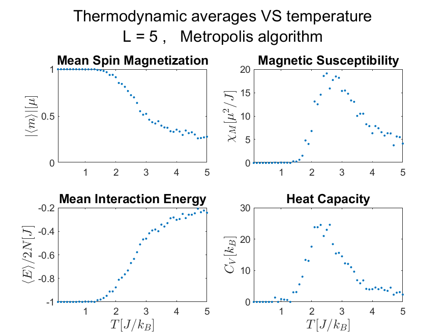
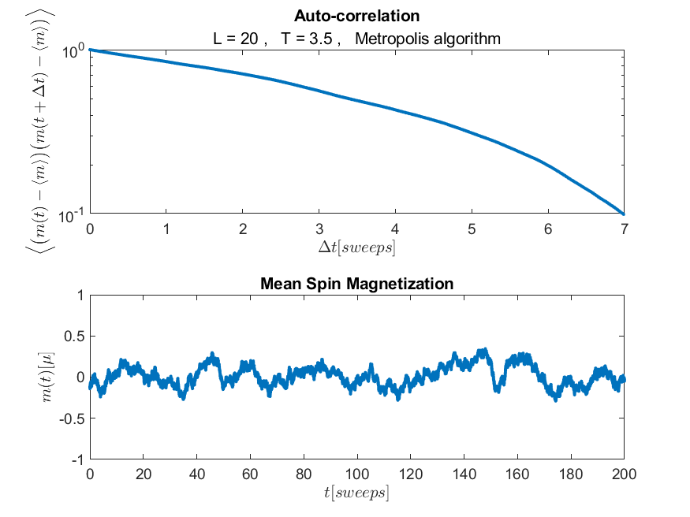

# Monte-Carlo methods - 2D spin lattice

This repository applies  a Monte-Carlo simulation scheme, involving a system of spins arranged in a 2D-lattice, using different algorithms. Dynamics are based on the basic Ising-model Hamiltonian: 
```math
H_0 = - J \sum_{\langle i,\; j \rangle} s_i s_j \; , \quad   \langle i, j \rangle: i ,\; j \quad \text{are nearest neighbors} ,
```
including only nearest-neighbor interactions between spins, and no external magnetic field (which can be easily included).

The scheme is flexible regarding both the possible spin values and the used algorithm, such that additional algorithms can be easily added to the modeling framework (by adding new [`step__*.m`](Code/) functions and including them in [`sim_basic.m`](Code/sim_basic.m). Furthermore, wide generalizations can be made with just a few steps (for example, an external field or higher order interactions can be included via slight modifications to the coupling or interaction functions, respectively). Introducing different models to it (such as higher-dimension lattices or angular spin directions) is reasonably achievable too, making this framework quite useful.

Hopefully, you'll find it useful too! 🙏
      
**OR HOSTEZKY**


## Script Index

> [!NOTE]
**Here, the general structure of this repository's [*Code*](Code/) section is described. For a more specific description, look at each script specifically.**

* [`nearest_neighbors_2D_open.m`](Code/nearest_neighbors_2D_open.m) and [`coupling_nearest_neighbors_2D.m`](Code/coupling_nearest_neighbors_2D.m) are the most basic functions, regarding spin ineteractions in a given matrix.

* The [`step__*.m`](Code/) functions execute the spin dynamics (a single algorithm-step) using the interaction functions, each of which 
  adheres to a different algorithm and model.
  <br> [`form_cluster.m`](Code/form_cluster.m) is a sub-function of the Wolff-algorithm step function.

* [`cluster_size__wolff__2D_ising.m`](Code/cluster_size__wolff__2D_ising.m) finds the typical spin-cluster sizes in the Wolff algorithm at 
  a given temperature.

* The [`*_correlation.m`](Code/) functions regard the auto-correlation of the system between different steps (i.e. 'time' correlation), 
  which helps to derive the system's decorrelation time, and thus to determine the needed number of steps between following measurements 
  (in order to get meaningful data thermodynamically).
  <br> [`plot__correlation.m`](Code/plot__correlation.m) is called by [`sim_correlation.m`](Code/sim_correlation.m).

* The [`sim_*.m`](Code/) functions execute the actual simulations, and communnicate between the apply scripts and the step functions (or
  [`find_correlation.m`](Code/find_correlation.m) in the case of [`sim_correlation.m`](Code/sim_correlation.m)). Their inner heirarchy is
  as such:
  <br>  $\quad\quad\quad\quad\quad\quad$  [`sim_temperatures.m`](Code/sim_temperatures.m)  $\quad \longmapsto \quad$  [`sim_smpl_avrg.m`](Code/sim_smpl_avrg.m)  $\quad \longmapsto \quad$  [`sim_basic.m`](Code/sim_basic.m)
  <br> [`plot__M_E_C_X__vs__T.m`](Code/plot__M_E_C_X__vs__T.m) is called by [`sim_temperatures.m`](Code/sim_temperatures.m).

* The [`app_*.m`](Code/) scripts are the main scripts that apply the simulation scheme, and are executed directly by the user.

### General repository scheme:
  $\quad$  **Apply scripts**  $\quad \longmapsto \quad$  **Simulation functions**  $\quad \longmapsto \quad$  **Step functions**  $\quad \longmapsto \quad$  **Basic interaction functions**

## Data and plots

Data and corresponding figures are automatically saved with easily identifiable, corresponding file names (including the simulation type, important parameter values, and used algorithm), in the [*Data*](Data/) and [*Plots*](Plots/) directories, respectively.

A few basic examples are already included in the repository, inside these two directories. Here are the two figure types that are currently produced by this repository:

 
